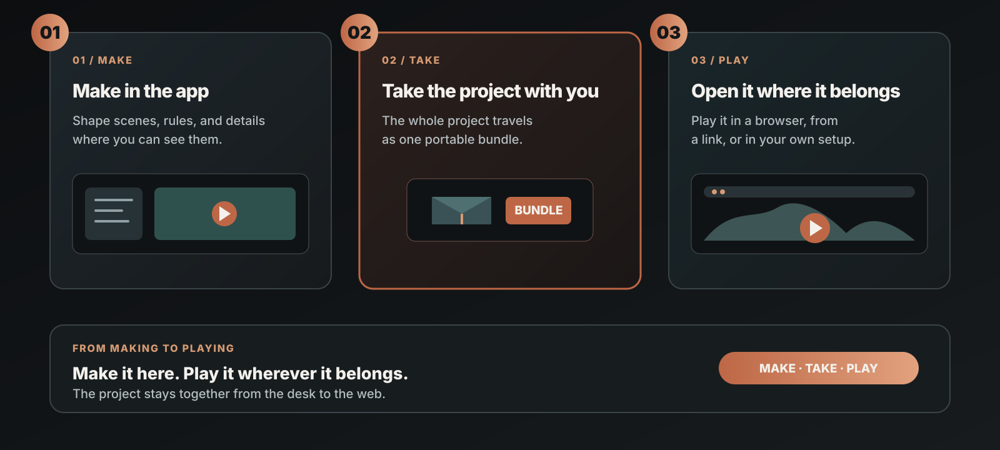

# BrewYourCode — Player Engine & Self-hosted Share

  Run exported BrewYourCode projects with an engine and Share service you control. 
  <strong>Desktop authoring app · project-bundle export · browser player engine</strong>

  <a href="https://github.com/Niceofer/BrewYourCode/releases">Desktop releases</a>
  · <a href="https://brewyourcode.com">Website</a>
  · <a href="./README_ko.md">한국어</a>
  · <a href="./README_ja.md">日本語</a>
  · <a href="./EULA.md">EULA</a>

## Browser-playable examples

These links open BrewYourCode projects in a browser. No installation is required.

- [Interactive Demo — Life Simulation](https://share.brewyourcode.com/byc_f8b97ef4c16045149399d27014556e48)
- [Game Demo — Interaction](https://share.brewyourcode.com/byc_b0cc670cf88f4838b6e1abd80e7755d5)

The 3D assets and environments in these examples were made in the BrewYourCode authoring tool.

## Project delivery

The desktop app exports a project as a portable bundle. This repository provides the player engine and self-hosted Share service that run the bundle in a browser.

| Delivery | Use it for |
| --- | --- |
| **Desktop authoring app** | Download the Windows or macOS build from [GitHub Releases](https://github.com/Niceofer/BrewYourCode/releases). Create and edit a project, then export a project bundle. |
| **Player engine code** | Clone this repository to run exported bundles locally or deploy your own Share service. The engine serves the browser runtime and share page. |

### ⚠️ Unsigned build — you will see a security warning

The desktop authoring app is not code-signed yet, so Windows and macOS will both warn before letting it run. This is expected for freeware distributed without a signing certificate — it is not a sign of a corrupted or tampered download. Here's how to get past it on each OS:

**Windows (SmartScreen):**
1. Double-click the installer — SmartScreen blocks it with "Windows protected your PC".
2. Click **More info**.
3. Click **Run anyway**.

**macOS (Gatekeeper) — a plain double-click will refuse to open the app, even after this:**
1. In Finder, **right-click** (or Control-click) the app → choose **Open** from the menu.
2. In the confirmation dialog, click **Open** again.
3. If that menu doesn't appear, open **System Settings → Privacy & Security**, scroll down to the blocked-app notice, and click **Open Anyway**.

You only need to do this once per download — the OS remembers your choice for that build.

## What you get

| Capability | What it means |
| --- | --- |
| Core player engine | Run exported projects in the browser through `/share/<shareKey>`. |
| Self-hosted Share service | Serve a bundle from infrastructure and storage you control. |
| Portable output | Move a share-key folder to another host, point `BYC_DATA_DIR` at it, and run the same player. |
| No player database | Playback reads the exported bundle; it does not need a database, RAG index, or cloud account. |
| Localized player UI | English, Korean, and Japanese player strings are included. |

## Architecture

~~~text
BrewYourCode desktop authoring app (Windows / macOS Releases)
  └─ Claude Code, Codex CLI, or your own API keys
       └─ Export project bundle (self-host)
            └─ <shareKey>/manifest.json + referenced assets
                 └─ BYC_DATA_DIR on your host
                      └─ Player engine + self-hosted Share service
                           └─ /share/<shareKey> in a browser
~~~

## Requirements

- [Node.js](https://nodejs.org/) **18.18 or newer** (Node 20 LTS recommended)
- npm
- An exported BrewYourCode project bundle

## Quick start

### 1. Clone and install the player engine

~~~bash
git clone https://github.com/Niceofer/BrewYourCode.git
cd BrewYourCode
npm install
~~~

### 2. Configure a bundle directory

macOS / Linux:

~~~bash
cp .env.example .env.local
~~~

Windows PowerShell:

~~~powershell
Copy-Item .env.example .env.local
~~~

Edit `.env.local`:

~~~dotenv
NEXT_PUBLIC_SHARE_BASE_URL=/api/local-share
BYC_DATA_DIR=./share_data
BYC_MODE=share
~~~

### 3. Create and export a project

Download the BrewYourCode desktop app for **Windows or macOS** from [GitHub Releases](https://github.com/Niceofer/BrewYourCode/releases). Create a project, then choose **Export bundle (self-host)** from its menu. Put the resulting folder under `BYC_DATA_DIR`:

~~~text
share_data/
└─ byc_<shareKey>/
   ├─ manifest.json
   ├─ assets/
   └─ ...
~~~

The folder name must match the share key used in the URL.

### 4. Run it

For development with hot reload:

~~~bash
npm run dev
~~~

For production:

~~~bash
npm run build
npm start
~~~

Open `http://localhost:3300/share/byc_<shareKey>` in a browser.

## Configuration

| Variable | Required | Purpose |
| --- | --- | --- |
| `BYC_DATA_DIR` | Yes | Filesystem root containing exported share-key folders. |
| `NEXT_PUBLIC_SHARE_BASE_URL` | Yes | Content endpoint used by the browser. Use `/api/local-share` for local bundles. |
| `BYC_MODE` | Recommended | Set to `share` to lock the host to the Share surface. The provided scripts do this automatically. |
| `NEXT_PUBLIC_CLOUD_BASE_URL` | No | Leave unset for fully self-hosted playback without a cloud play counter. |

Keep `.env.local` out of version control. Do not place credentials in browser-visible `NEXT_PUBLIC_*` variables.

## Security model

- `BYC_MODE=share` is a default-deny gate: it permits only `/share`, required Next.js/static assets, and `/api/local-share`.
- `/api/local-share` reads only from `BYC_DATA_DIR` and validates resolved filesystem paths before serving files.
- The player engine does not need your AI API keys, Claude Code credentials, Codex login, or authoring data.
- Treat exported bundles as publishable content. Review each bundle and choose an appropriate host access policy before making it public.

## Project layout

~~~text
app/share/[shareKey]/          Share page and runtime UI
app/api/local-share/           Local exported-bundle file route
proxy.ts                        Share-mode allowlist / default-deny gate
public/                         Bundled player assets and fallbacks
.env.example                    Self-host configuration template
~~~

## Commands

| Command | Purpose |
| --- | --- |
| `npm run dev` | Start the Share-only development server on port 3300. |
| `npm run build` | Create a production Next.js build. |
| `npm start` | Start the production Share-only server on port 3300. |

## Support and legal

- Product site: [brewyourcode.com](https://brewyourcode.com)
- Desktop authoring app: [GitHub Releases](https://github.com/Niceofer/BrewYourCode/releases)
- Community: [Discord](https://discord.gg/aFjbNBh6)
- License terms: [EULA](./EULA.md)
- Third-party notices: [THIRD-PARTY-LICENSES.md](./THIRD-PARTY-LICENSES.md)

The player engine code is published for self-hosting and inspection. Review [LICENSE.md](./LICENSE.md) and the [EULA](./EULA.md) for the controlling terms.