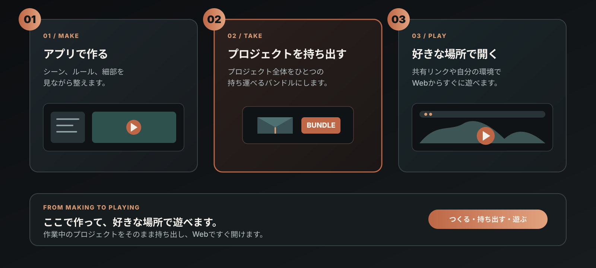

# BrewYourCode — プレイエンジン & セルフホスト Share

  <strong>BrewYourCodeは、コードを書かずにゲームを作るAIネイティブゲームエンジンです。</strong> 
  エクスポートしたBrewYourCodeプロジェクトを、自分で管理するエンジンとShareサービスで実行します。 
  <strong>このリポジトリ: ブラウザプレイエンジン · セルフホストShareサービス</strong>

  <a href="https://github.com/Niceofer/BrewYourCode/releases">Desktop releases</a>
  · <a href="https://brewyourcode.com">Website</a>
  · <a href="./README.md">English</a>
  · <a href="./README_ko.md">한국어</a>
  · <a href="./EULA.md">EULA</a>

## ブラウザで実行できる例

次のリンクはBrewYourCodeで作成したコンテンツです。インストールなしでブラウザから開いて実行できます。

- [インタラクティブデモ — Life Simulation](https://share.brewyourcode.com/byc_f8b97ef4c16045149399d27014556e48)
- [ゲームデモ — Interaction](https://share.brewyourcode.com/byc_b0cc670cf88f4838b6e1abd80e7755d5)

この例の3Dアセットと環境は、BrewYourCodeの制作ツールで作成されています。

## プロジェクトの配布

デスクトップアプリはプロジェクトをポータブルなバンドルとして出力します。このリポジトリのプレイエンジンとセルフホストShareサービスが、そのバンドルをブラウザで実行します。

| 配布物 | 用途 |
| --- | --- |
| **デスクトップ作成アプリ** | [GitHub Releases](https://github.com/Niceofer/BrewYourCode/releases)からWindowsまたはmacOS版をダウンロードします。プロジェクトを作成して編集し、プロジェクトバンドルを出力します。 |
| **プレイエンジンコード** | このリポジトリをクローンし、エクスポート済みバンドルをローカルで実行するか、自分のShareサービスとしてデプロイします。 |

### ⚠️ 未署名ビルド — セキュリティ警告が表示されます

デスクトップ作成アプリはまだコード署名されていないため、WindowsとmacOSの両方で実行前に警告が表示されます。署名証明書なしで配布されているフリーウェアでは想定内の挙動であり、ダウンロードファイルが破損・改ざんされているという意味ではありません。OSごとの回避方法は以下のとおりです。

**Windows（SmartScreen）:**
1. インストーラーをダブルクリックすると「WindowsによってPCが保護されました」という警告が表示されます。
2. **詳細情報** をクリックします。
3. **実行** をクリックします。

**macOS（Gatekeeper）— この手順のあとも、そのままダブルクリックすると再度ブロックされます:**
1. Finderでアプリを **右クリック**（またはControlキーを押しながらクリック）し、メニューから **開く** を選択します。
2. 確認ダイアログでもう一度 **開く** をクリックします。
3. メニューが表示されない場合は **システム設定 → プライバシーとセキュリティ** を開き、下にスクロールしてブロックされたアプリの通知から **このまま開く** をクリックします。

この操作はそのビルドについて一度だけ行えば十分で、以降はOSが選択内容を記憶します。

## クイックスタート

### 1. プレイエンジンをクローンしてインストール

~~~bash
git clone https://github.com/Niceofer/BrewYourCode.git
cd BrewYourCode
npm install
cp .env.example .env.local
~~~

Windows PowerShell:

~~~powershell
Copy-Item .env.example .env.local
~~~

`.env.local` を設定します。

~~~dotenv
NEXT_PUBLIC_SHARE_BASE_URL=/api/local-share
BYC_DATA_DIR=./share_data
BYC_MODE=share
~~~

### 2. プロジェクトを作成してエクスポート

[GitHub Releases](https://github.com/Niceofer/BrewYourCode/releases)から**WindowsまたはmacOS**用のBrewYourCodeデスクトップアプリをダウンロードします。プロジェクトを作成し、メニューから **Export bundle (self-host)** を選択します。出力されたフォルダーを `BYC_DATA_DIR` の下に置きます。

~~~text
share_data/
└─ byc_<shareKey>/
   ├─ manifest.json
   ├─ assets/
   └─ ...
~~~

### 3. 実行

~~~bash
npm run dev
# または本番用
npm run build
npm start
~~~

ブラウザで `http://localhost:3300/share/byc_<shareKey>` を開きます。

## 開発者向け要点

- Node.js 18.18以上（Node 20 LTS推奨）とnpmが必要です。
- `BYC_MODE=share` はデフォルト拒否ゲートです。`/share`、必要な静的アセット、`/api/local-share` 以外は公開しません。
- `/api/local-share` は `BYC_DATA_DIR` 内だけから、検証済みのファイルパスを通してコンテンツを読みます。
- プレイエンジンにAI APIキー、Claude Code認証情報、Codexログイン、作成データは必要ありません。
- エクスポート済みバンドルは公開コンテンツとして扱い、公開前に確認してください。

詳細な構成・環境変数・セキュリティモデルは [English README](./README.md) または [한국어 README](./README_ko.md) を参照してください。

## サポートとライセンス

- [brewyourcode.com](https://brewyourcode.com)
- [Desktop releases](https://github.com/Niceofer/BrewYourCode/releases)
- [Discord](https://discord.gg/aFjbNBh6)
- [EULA](./EULA.md)
- [LICENSE.md](./LICENSE.md)

プレイエンジンコードはセルフホストと確認のために公開されています。適用条件はEULAとLICENSE.mdを確認してください。
