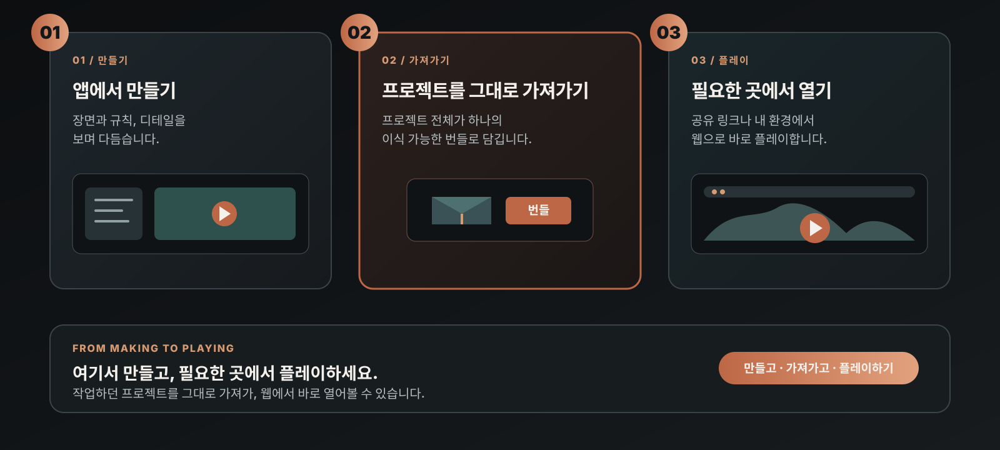

# BrewYourCode — 플레이 엔진 & 자체 호스팅 Share

  <strong>BrewYourCode는 코드 없이 게임을 만드는 AI 네이티브 게임 엔진입니다.</strong> 
  내보낸 BrewYourCode 프로젝트를 직접 제어하는 엔진과 Share 서비스로 실행하세요. 
  <strong>이 저장소: 브라우저 플레이 엔진 · 자체 호스팅 Share 서비스</strong>

  <a href="https://github.com/Niceofer/BrewYourCode/releases">데스크톱 릴리스</a>
  · <a href="https://brewyourcode.com">웹사이트</a>
  · <a href="./README.md">English</a>
  · <a href="./README_ja.md">日本語</a>
  · <a href="./EULA_ko.md">EULA</a>

## 브라우저 실행 예시

아래 링크는 BrewYourCode로 만든 콘텐츠입니다. 설치 없이 브라우저에서 열고 실행할 수 있습니다.

- [인터랙티브 데모 — Life Simulation](https://share.brewyourcode.com/byc_f8b97ef4c16045149399d27014556e48)
- [게임 데모 — Interaction](https://share.brewyourcode.com/byc_b0cc670cf88f4838b6e1abd80e7755d5)

이 예시의 3D 에셋과 환경은 BrewYourCode 저작 도구에서 제작되었습니다.

## 프로젝트 배포

데스크톱 앱은 프로젝트를 이식 가능한 번들로 내보냅니다. 이 저장소의 플레이 엔진과 자체 호스팅 Share 서비스는 해당 번들을 브라우저에서 실행합니다.

| 배포물 | 용도 |
| --- | --- |
| **데스크톱 저작 앱** | [GitHub Releases](https://github.com/Niceofer/BrewYourCode/releases)에서 Windows 또는 macOS 버전을 내려받습니다. 프로젝트를 만들고 편집한 뒤 프로젝트 번들을 내보냅니다. |
| **플레이 엔진 코드** | 이 저장소를 복제해 내보낸 번들을 로컬에서 실행하거나 자체 Share 서비스를 배포합니다. 엔진은 브라우저 런타임과 공유 페이지를 제공합니다. |

### ⚠️ 서명되지 않은 빌드 — 보안 경고가 표시됩니다

데스크톱 저작 앱은 아직 코드 서명이 되어 있지 않아 Windows와 macOS 모두 실행 전 경고를 띄웁니다. 서명 인증서 없이 배포되는 프리웨어에서 흔히 발생하는 정상적인 현상이며, 다운로드 파일이 손상되거나 변조되었다는 의미가 아닙니다. OS별 우회 방법은 다음과 같습니다.

**Windows (SmartScreen):**
1. 설치 파일을 더블클릭하면 "Windows에서 PC를 보호했습니다" 경고가 뜹니다.
2. **추가 정보**를 클릭합니다.
3. **실행**을 클릭합니다.

**macOS (Gatekeeper) — 이 절차 이후에도 그냥 더블클릭하면 다시 차단됩니다:**
1. Finder에서 앱을 **우클릭**(또는 Control+클릭)한 뒤 메뉴에서 **열기**를 선택합니다.
2. 확인 대화상자에서 다시 **열기**를 클릭합니다.
3. 메뉴가 뜨지 않으면 **시스템 설정 → 개인정보 보호 및 보안**을 열고 아래로 스크롤해 차단된 앱 안내에서 **확인 없이 열기**를 클릭합니다.

이 과정은 해당 빌드에 대해 한 번만 하면 되며, 이후 OS가 선택을 기억합니다.

## 제공 기능

| 기능 | 설명 |
| --- | --- |
| 플레이 엔진 코어 | `/share/<shareKey>` 경로로 내보낸 프로젝트를 브라우저에서 실행합니다. |
| 자체 호스팅 Share 서비스 | 직접 제어하는 인프라와 스토리지에서 번들을 서비스합니다. |
| 이식 가능한 결과물 | share key 폴더를 다른 호스트로 옮기고 `BYC_DATA_DIR`만 지정하면 같은 플레이어로 실행할 수 있습니다. |
| 플레이어 DB 없음 | 플레이어는 내보낸 번들을 읽으며 데이터베이스·RAG 인덱스·클라우드 계정이 필요하지 않습니다. |
| 다국어 플레이어 UI | 영어·한국어·일본어 플레이어 문자열을 포함합니다. |

## 구조

~~~text
BrewYourCode 데스크톱 저작 앱 (Windows / macOS Releases)
  └─ Claude Code, Codex CLI 또는 자신의 API 키
       └─ 프로젝트 번들 내보내기 (self-host)
            └─ <shareKey>/manifest.json + 참조 에셋
                 └─ 호스트의 BYC_DATA_DIR
                      └─ 플레이 엔진 + 자체 호스팅 Share 서비스
                           └─ 브라우저의 /share/<shareKey>
~~~

## 요구 사항

- [Node.js](https://nodejs.org/) **18.18 이상** (Node 20 LTS 권장)
- npm
- BrewYourCode에서 내보낸 프로젝트 번들

## 빠른 시작

### 1. 플레이 엔진 복제 및 설치

~~~bash
git clone https://github.com/Niceofer/BrewYourCode.git
cd BrewYourCode
npm install
~~~

### 2. 번들 디렉터리 설정

macOS / Linux:

~~~bash
cp .env.example .env.local
~~~

Windows PowerShell:

~~~powershell
Copy-Item .env.example .env.local
~~~

`.env.local`을 열어 설정합니다.

~~~dotenv
NEXT_PUBLIC_SHARE_BASE_URL=/api/local-share
BYC_DATA_DIR=./share_data
BYC_MODE=share
~~~

### 3. 프로젝트 제작 및 내보내기

[GitHub Releases](https://github.com/Niceofer/BrewYourCode/releases)에서 **Windows 또는 macOS**용 BrewYourCode 데스크톱 앱을 받습니다. 프로젝트를 만든 뒤 메뉴에서 **Export bundle (self-host)** 을 선택하고 결과 폴더를 `BYC_DATA_DIR` 아래에 둡니다.

~~~text
share_data/
└─ byc_<shareKey>/
   ├─ manifest.json
   ├─ assets/
   └─ ...
~~~

폴더 이름은 URL에 사용할 share key와 일치해야 합니다.

### 4. 실행

핫 리로드 개발 서버:

~~~bash
npm run dev
~~~

운영 환경:

~~~bash
npm run build
npm start
~~~

브라우저에서 `http://localhost:3300/share/byc_<shareKey>`를 엽니다.

## 설정 값

| 변수 | 필수 | 설명 |
| --- | --- | --- |
| `BYC_DATA_DIR` | 예 | 내보낸 share key 폴더를 보관하는 파일 시스템 루트입니다. |
| `NEXT_PUBLIC_SHARE_BASE_URL` | 예 | 브라우저가 콘텐츠를 읽는 엔드포인트입니다. 로컬 번들은 `/api/local-share`를 사용합니다. |
| `BYC_MODE` | 권장 | `share`로 설정하면 호스트를 Share 표면으로 제한합니다. 제공 스크립트가 자동으로 설정합니다. |
| `NEXT_PUBLIC_CLOUD_BASE_URL` | 아니오 | 클라우드 플레이 카운터 없이 완전 자체 호스팅하려면 비워둡니다. |

`.env.local`은 버전 관리에 넣지 마세요. 브라우저에 노출되는 `NEXT_PUBLIC_*` 변수에 자격 증명을 넣으면 안 됩니다.

## 보안 모델

- `BYC_MODE=share`는 기본 거부 게이트입니다. `/share`, 필요한 Next.js/정적 에셋, `/api/local-share`만 허용합니다.
- `/api/local-share`는 `BYC_DATA_DIR` 내부의 파일만 읽고, 실제 파일 시스템 경로를 검증한 뒤 서비스합니다.
- 플레이 엔진은 AI API 키, Claude Code 자격 증명, Codex 로그인, 저작 데이터를 필요로 하지 않습니다.
- 내보낸 번들은 게시 가능한 콘텐츠로 취급하세요. 외부에 공개하기 전 번들을 검토하고 호스트 접근 정책을 정하세요.

## 프로젝트 구조

~~~text
app/share/[shareKey]/          공유 페이지와 런타임 UI
app/api/local-share/           로컬 내보내기 번들 파일 라우트
proxy.ts                        share 모드 허용 목록 / 기본 거부 게이트
public/                         번들 플레이어 에셋과 폴백
.env.example                    자체 호스팅 설정 템플릿
~~~

## 명령어

| 명령어 | 설명 |
| --- | --- |
| `npm run dev` | 3300 포트에서 Share 전용 개발 서버를 실행합니다. |
| `npm run build` | 운영용 Next.js 빌드를 생성합니다. |
| `npm start` | 3300 포트에서 운영용 Share 전용 서버를 실행합니다. |

## 지원 및 라이선스

- 제품 웹사이트: [brewyourcode.com](https://brewyourcode.com)
- 데스크톱 저작 앱: [GitHub Releases](https://github.com/Niceofer/BrewYourCode/releases)
- 커뮤니티: [Discord](https://discord.gg/aFjbNBh6)
- 라이선스 조건: [EULA](./EULA_ko.md)
- 제3자 고지: [THIRD-PARTY-LICENSES.md](./THIRD-PARTY-LICENSES.md)

플레이 엔진 코드는 자체 호스팅과 검토를 위해 공개됩니다. 적용 약관은 [LICENSE.md](./LICENSE.md)와 [EULA](./EULA_ko.md)를 확인하세요.
